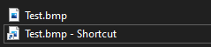
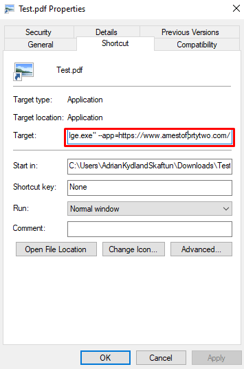
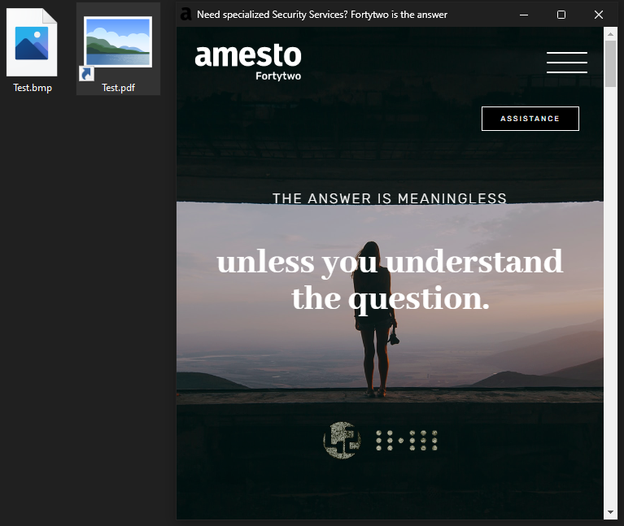

# Webbrowser based phishing technique

Phishing is one of the most dangerous and ugliest types of attacks out there, because it is based on human interaction, naiveness and error. The only reason for a computer to fail is because someone told it to - meaning errors in code or other related human misconfigurations. MFA fatigue is one ongoing way of exploiting human "weakness" as Kjetil mentioned in his blogpost relating to the Uber breach. I'm going to highlight another,  new technique demonstrated by [mr.d0x](https://mrd0x.com/phishing-with-chromium-application-mode/). And we will dive into some KQL to help you investigate this kind of attack further by hunting for the obvious relating to it.

## Phishing technique walkthrough
This technique uses Chromium based browsers like Google Chrome or MSEdge as a Desktop applications with local malicious login forms disguised as a trustworthy app. It all takes the form of a shortcut file, lnk, with a tiny script.

What makes this phishing technique stealthy is that it hides it self in appearance of a regular Desktop app. Once you open the app it launches a webbrowser in app-mode, which does not have the addressbar at the top - meaning that you have one less way of approving that the site you are directed to is legitimate. You can easily design a fake address bar as well as the logo for the application, hiding everything obvious that resembles an lnk file, just like mr.d0x did in the article above.

### What is an lnk file?
The name kinda gives it away - it links to another file. Normally refered to as a shortcut. The actual file is stored somewhere else, and a shortcut file only points to where the data is stored. What is also worth mentioning about these files is that their extension is not showing, even if you have enabled windows to show extensions.

  

This also lets us masquerade the file as whatever we want. The shortcut symbol may give it away, but this may be replaced by another symbol if you have it in a OneDrive synced folder for instance. 

The appmode mentioned belongs to Chromium browsers, which is an open source project that a lot of todays modern browsers are based upon. 

Lets create the payload as shown in the screenshot:  
  

Paste this snippet into the "Target" field within the shortcut files properties if you are changing a shorcut already made. If you are creating a new one, paste it into the window that appears through the wizard.

    "C:\Program Files (x86)\Microsoft\Edge\Application\msedge.exe" --app=https://www.amestofortytwo.com/

Here is what the output looks like once you open the file:
  
Note the minimalistic web browser view, no address bar, jpg icon, pdf extension. Also - another thing that makes it harder to spot is that Windows Taskbar displays the favicon of the webpage, not the browser icon.

Note! This is not a well thought-through attack I'm showing (with jpg icon and pdf extension), it just shows some possibilities.

### KQL-query to go hunt for this activity
Armed with some knowledge on how this exploit works, it's time to go hunt for it. We know that it runs a command when opened - well, lets look for it. We also know what the command might contain (like browsers), and that it uses appmode ("--app"), it might reach out to the wide web ("http"). Lets limit this to use with only lnk files as well. Use this query as a starting place to dig deeper into your logs. 

    DeviceFileEvents
    | where InitiatingProcessFileName has_any ("msedge", "chrome")
    | where InitiatingProcessCommandLine has_any ("--app", "http")
    | where FileName endswith "lnk"
    | project
        TimeGenerated,
        DeviceName,
        FileName,
        FolderPath,
        InitiatingProcessFolderPath,
        InitiatingProcessAccountName,
        InitiatingProcessCommandLine,
        PreviousFileName,
        MD5,
        SHA1,
        SHA256
        
The above query does not give you any answers, it just looks at indicators known to belong to this attack. It's up to you to investigate the maliciousness of the query output. Correlating between known indicators (file-hashes, IPs...), tactics and behavior will take you far.

A wider search option would be to search for related artefacts of this attack by this query (feel free to change what's inside the quotes or even the tables). This query searches through all tables that starts with "Device" where "--app" is present:

    search in (Device*) "--app"

You can do a search for files in the aggregated table "imFileEvent" and see if there is a mismatch between the extension of the filename and the actual filetype. Doing this I also learned that the actual file type is appended to the filename by Sentinel, which means that there will be two file extensions when viewing the logs, if the mentioned technique is being applied. Try finding this by:

    let knownFileExts = dynamic(["pdf", "jpg", "txt", "bin", "exe"]);
    imFileEvent
    | where SourceFileExtension == "lnk"
    | extend splittedFNExt = split(SourceFileName, ".")
    | where splittedFNExt[-2] in (knownFileExts)

We are creating a dynamic variable type which we populate with a list of known fileextensions(nowhere complete). And then we limit the result from imFileEvent on the fileextension "lnk" (which we know is added inside the logs) before we split the filename, to compare the possible double fileextension based on the list of fileextensions.

Here is a wider, yet powerfull search. Tune it to your need. This looks through every table that starts with "Device" and where any rows has "--app". Before we shorten it down even more with "lnk" in FileName.

    search in (Device*) "--app"
    | where FileName has "lnk"

Another approach will be to first look for lnk files that have been downloaded, maybe coming from an email attachment in a phishing mail. Then use the filename of the downloaded lnk file for further investigation through any of the tables we have hightlighted in the query examples provided. 

## How do I protect myself?
One case of protection is to investigate, but that is an "after the fact" protection,  to stay up front in case of an attack Microsoft has a great way of protecting you if you enable Web Protection in Defender for endpoint. To quote MS: "Web threat protection stops access to phishing sites, malware vectors, exploit sites, untrusted or low-reputation sites, as well as sites that you have blocked in your custom indicator list."

Read more about Microsofts Web protection in Defender for Enpoint [here](https://learn.microsoft.com/en-us/microsoft-365/security/defender-endpoint/web-threat-protection?view=o365-worldwide)

If you have any suggestions for improvement of this article, please let me know!

### Resources
https://learn.microsoft.com/en-us/microsoft-365/security/defender/advanced-hunting-devicefileevents-table?view=o365-worldwide  
https://learn.microsoft.com/en-us/microsoft-365/security/defender-endpoint/web-threat-protection?view=o365-worldwide  
https://mrd0x.com/phishing-with-chromium-application-mode/