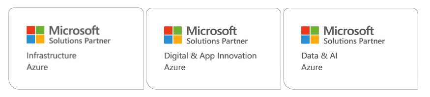

# Changes in Microsoft Partner program and how this has changed our skilling focus

From October 3rd Microsoft changed its Partner Programme. The Gold and Silver partner designations are being replaced with Solutions Partner designations.

From now on Microsoft Partners can achieve Solutions Partner designations in the following areas:

- Security
- Infrastructure
- Digital and App Innovation
- Data and AI
- Modern work
- Business Apps

These designations are harder to achieve than the previous gold and silver competencies as they measure not only the skilling level on our organisation, but also the growth and successful deployments we implement for our customers.

Since the new program was announced we have been working steadily to achieve the Solution Partner designations relevant to our business.

This work follows along three lines

- Ensuring our cloud engineers up-skill according to the new requirements.
- Associating closer with our customers, ensuring the value we create is made visible to both our customers and   Microsoft.
- Creating modern solutions available for our customers in Azure Marketplace

This enables us to create quick and lasting value for our customers by delivering modern solutions, with the best advice on how to realize the value these solutions provide.

## What does these changes mean for you as a customer?

You now have an even better way to identify partners who are skilled in the latest Microsoft technologies and have created value for customers in the past. Achieving a solutions partner designation requires dedication over time.

How are we progressing?
So far we have achieved Solutions Partner designations for the following areas.

- Infrastructure
- Digital and App Innovation

In addition to that our sister company Amesto Solutions have achieved the Data and AI Solutions Partner designation.

Our focus for the rest of the year is achieving the Security and Modern Work designations as well.

Want to know more about how we can add value to your Microsoft portfolio as well? Do not hesitate to get in touch.

