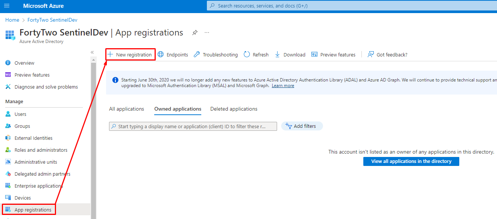
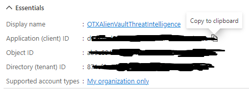
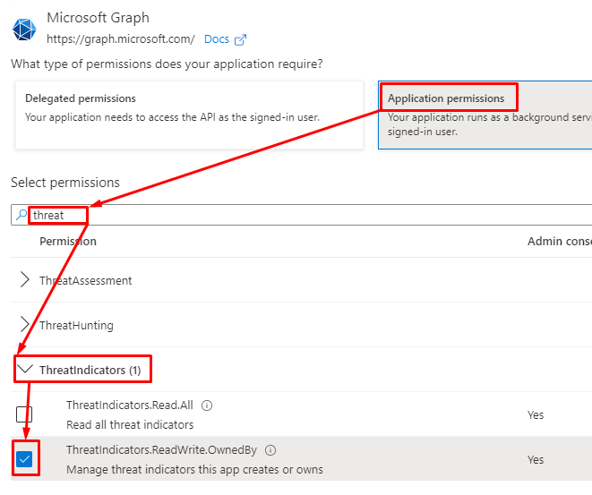
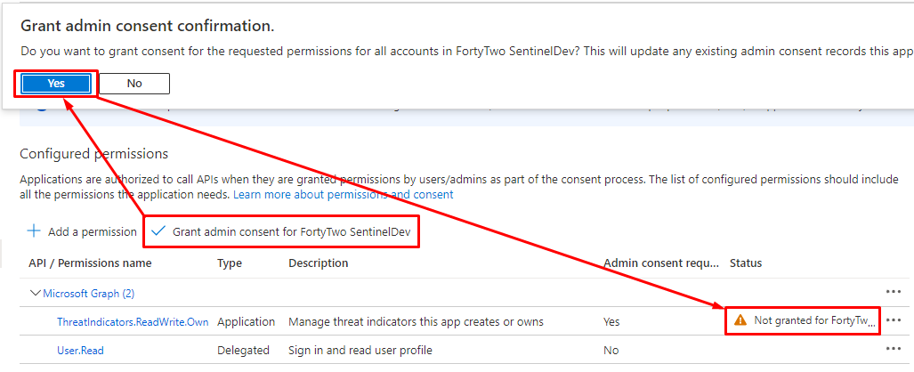
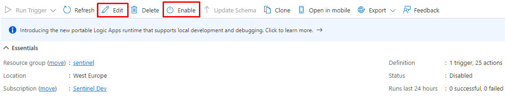
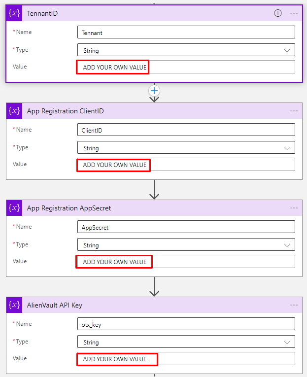

# Deploying AlienVault TI to Sentinel - short walkthrough

Through this article we will be setting up AlienVault OTX as Threat Intelligence towards our Sentinel Workspace. I want to keep this short and to the point, making it easier for any reader to just jump into this whenever they need to refresh some steps or for the first time setting it up.
### Requirements
There are some requirements you need to make sure you have. This is not a "how to deploy Sentinel"-included article, I assume you already have Sentinel deployed. Also, you need an account at AlienVault to get your API-key. You also need to be able to PIM-up to Global admin, to make the necessary applications towards our end goal.

### Getting the AlienVault API-key
To get the required API-key from AlienVault, login to your user at [otx.alienvault.com](https://otx.alienvault.com) and navigate to the "API Integration" from the top menu. Then copy the OTX-API-KEY. 

### Setting up the API ingestion app registration
We need to have an application that lets us use the Microsoft Graph Security tiIndicators API to send our TI into Sentinel.

From these following steps we want to acquire:
- Application (client) ID, 
- Directory (tenant) ID, and 
- a Client secret. 

1. Go to portal.azure.com and PIM up to Global Admin ([How to](https://learn.microsoft.com/en-us/azure/active-directory/privileged-identity-management/pim-resource-roles-activate-your-roles))
2. Choose "Azure Active Directory".
3. Click "App registrations"
4. "New registration"

5. The only thing needed to be filled out is the Name, and choose "Accounts in this organizational directory only (... - Single tenant)" and click "Register"
6. Make a copy of or note somewhere both the Application (client) ID and Directory (tenant) ID values. (For windows, activate clipboard - windows + "V" - for multiple copy and pastes in one go).   
7. Select "Api Permissions" from the left menu
8. There go to "Add a permission" and select "Microsoft Graph" and then "Application permissions"
9. Search for "threat" or scroll far down, locate the "ThreatIndicators.ReadWrite.OwnedBy" permission and check the box before clicking "Add permissions".   
10. Click the "Grant admin consent for YourTenantName" which will change the warning to a "Granted for..." message. 
11. To create a secret, go to "Certificates & secrets" on the left menu.
12. Click "New client secret", create a description and set wanted expiry before clicking "Add".
13. Copy the "Value" field now - you cannot retrieve it later on.

## Deploying the ready-made Logic app
1. Go to [THIS](https://github.com/Azure/Azure-Sentinel/tree/master/Playbooks/Get-AlienVault_OTX) Github page, scroll to the bottom and click the "Deploy to Azure" button.
2. Preferrably you choose the subscription you have Sentinel in, and the Resource Group.
3. Click "Review + Create" and then "Create".
4. Next, click "Go to resource", which shows up sequentially.
5. Click "Edit", make a note of the "Enable" as well. 

6. Paste in all the values from the previous steps.   
7. Scroll down to the step beginning with "Lookback Days..." and set the value to 365 days and save the app.
8. Close down the "Edit" window with the "X" in the right upper corner.
9. Remember from step 5 - "Enable" - click it.
10. Now, run the trigger, the far left on the same menu bar! This may take a while, as it is looking back a whole year (365 days). For me, this took about an hour.
11. We're not done yet. The first time this app is run, we set it to lookback for 365 days. We need to change that to "-1" to look back one day for the next scheduled runs, or a with a different setup. Your Choice!

Enjoy the feed from your AlienVault account! :)

#### Resources
https://github.com/Azure/Azure-Sentinel/tree/master/Playbooks/Get-AlienVault_OTX  
https://thewindowsupdate.com/2020/02/11/bring-your-threat-intelligence-to-azure-sentinel/  
https://techcommunity.microsoft.com/t5/microsoft-sentinel-blog/ingesting-alien-vault-otx-threat-indicators-into-azure-sentinel/ba-p/1086566  
https://cybergeeks.cloud/2022/05/how-to-integrate-alien-vault-otx-threat-indicators-into-microsoft-sentinel/  
https://learn.microsoft.com/en-us/azure/active-directory/privileged-identity-management/pim-resource-roles-activate-your-roles  

