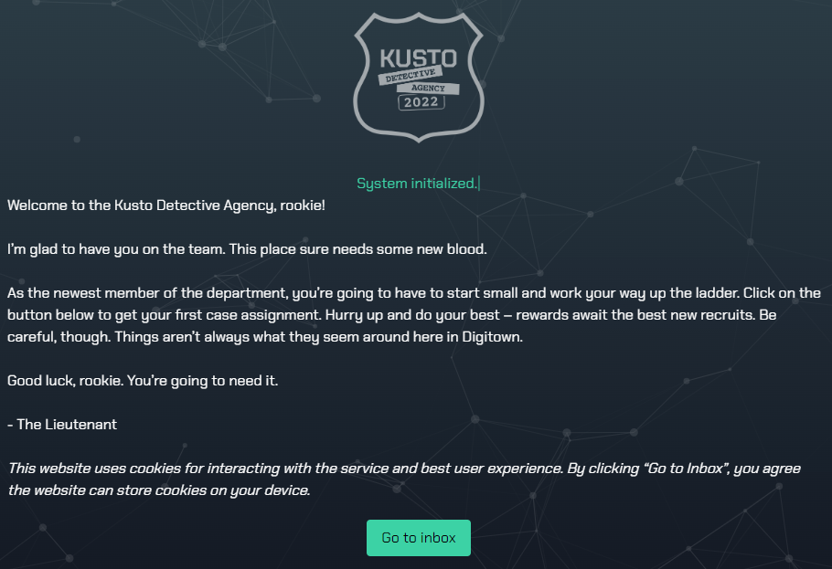
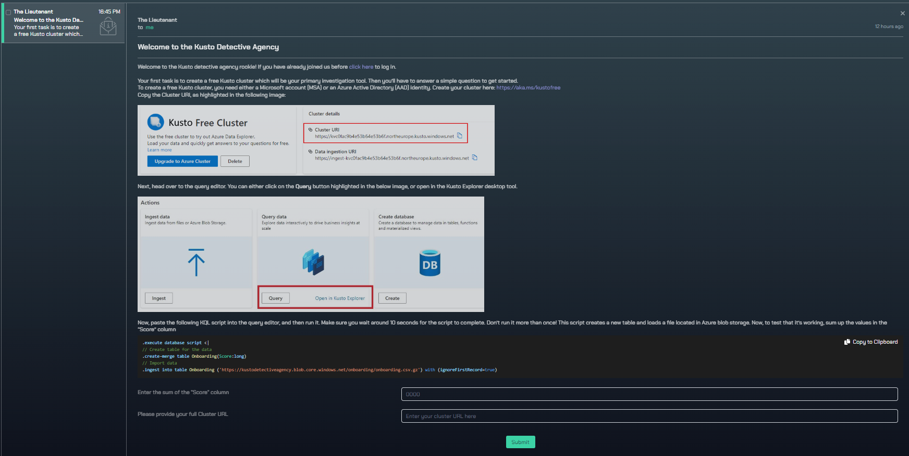
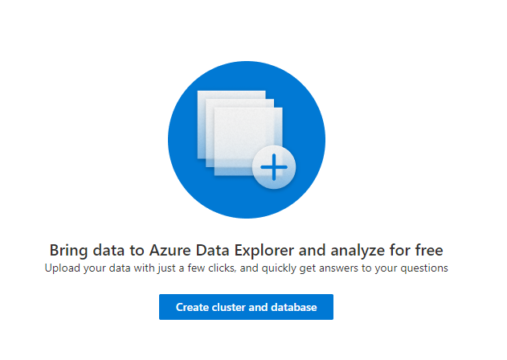
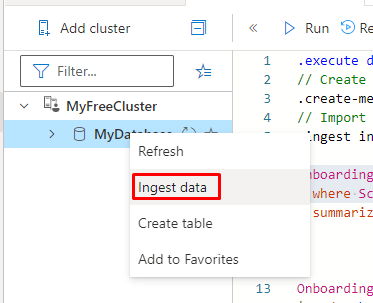

# Kusto Detective - Rookie - Onboarding
## Introduction

Microsoft has created this wonderful CTF like challenge for all of us to go into the depths of some possibilities that resides in the Kusto Query Language (KQL). Now, not to spoil everything I really hope that you have tried your best before landing here - because I will provide you with one of many solution to get through this series of tasks, starting with the onboarding. This is considered as a "Rookie" level, which is your starting title in upper right corner on the dashboard. 

This article is aimed towards beginners that needs to "fill in the gaps". Therefore things are explained with this in mind. I would also like to point out that these tasks takes into consideration that you practice in between the steps provided here. Like many programs and softwares we run, this challenge also has it quirks - at the end of some of the guides (including this) you will find some help for troubleshooting.

Do not expect these tasks to go lightly if you do not practice. With this series of walkthroughs I would like to minimize that gap, but also to provide you some insight into how I aproached these - as I used these tasks myself to get better at KQL. Reading KQL (as with most languages) might be a lot easier than writing it, especially when all you have is a goal in mind and do not know the syntax nor the possibilities.

If you want a more thorough lesson on KQL, here's a short list that will take you really far:
- [Must learn KQL by Rod Trent](https://aka.ms/MustLearnKQL)
- [Microsoft Learn modules ADX](https://learn.microsoft.com/en-us/azure/data-explorer/)
- [Microsoft Learn modules KQL](https://learn.microsoft.com/en-us/azure/data-explorer/kusto/query/)
- [ADX training modules MS Learn](https://learn.microsoft.com/en-us/training/modules/intro-to-azure-data-explorer/)
- [Pluralsight courses](https://www.pluralsight.com/partners/microsoft/azure-data-explorer)
- [John Saville video](http://aka.ms/StartKqlVideo)

## Let's dive in
Go to https://detective.kusto.io/inbox and click "Go to inbox". (PS: if you are returning and logged out, you need to enter your Cluster URI once more to get back to where you were).

 

Click the first message you have received there and read through it. You are presented with an instruction on how to set up your first cluster of data within Azure Data Explorer (ADX). This should be easy. The guide provided there are pretty straight forward, I'll just leave a Screenshot for future reference: 

  

There are, as you can see a blade called "Hints". On this you can get at most three hints. Ill keep a screenshot on every artice in the series and incorporate them into my solutions somehow. For this Rookie badge, we are not provided any hints, as it is considered to low level.

# Setting up the cluster
Go to https://aka.ms/kustofree and click "Create cluster and database". 

  

Approve terms of service and create (Change cluster name and database name if you want). It may load for a minute or so.

Copy the Cluster URI and paste it into the solution boxes on the detective dashboard, which may look like this: 

  

Now, copy the query in the code box on the detective dashboard:

```sql
    .execute database script <|
    // Create table for the data
    .create-merge table Onboarding(Score:long)
    // Import data
    .ingest into table Onboarding ('https://kustodetectiveagency.blob.core.windows.net/onboarding/onboarding.csv.gz') with (ignoreFirstRecord=true)
```

Go into where you can query data and paste the query: 

  

The best shortcut you'll ever learn is "SHIFT+ENTER" to run a query. The query runs for a few seconds. What has happened you may think... This query has ingested data that we should continue using for this Rookie task, meaning this was a necessary step to get to work further. This step of ingestion will be repeated for every new task coming, and time for ingestion may take a lot longer than now, depending on how much data is being processed.

Let's take a look at what data has been ingested by running this query:

```sql
Onboarding
```
As simple as that. This query asks the database for all it's content outputting it below.

  

Now, the task is to "Enter the sum of the "Score" column". There is a hint right there: "sum". They want us to sum up the Score column.

KQL has this function native: sum(). This is an aggregation function that works like you'd expect. You can do math within the brackets or simply by adding the Score column, it will add every number from that column. Read more about it [here](https://learn.microsoft.com/en-us/azure/data-explorer/kusto/query/sum-aggfunction)

```sql
Onboarding
| summarize sum(Score)
```

Now, paste the score into the last field on the detective dashboard. The following form leaves a note that "There are no gifts left to claim", but your second task is open! I guess that makes for the first (few) blood badges that were available to some. 

A little curious on this I started to wonder if I had misunderstood something on the topics of `sum()` because I though "how can all these huge positive numbers equal such a low positive number?". By ordering the numbers ascending and descending I could not find the negative number I wanted to see to make it more logical. But I did find it by this query:

    Onboarding
    | where Score < 0

As intuitive as KQL is, this is basically telling the database to output any value from the Onboarding table where Score has a value less than 0. And there it is. Run it to see for yourself. 


## Troubleshooting Ingestion

I did stumble upon some trouble when ingesting data with the query provided on the detective dashboard. The way I solved it was by copying the link provided inside the ingestion query and went for a manual ingestion. 

  

Choose your existing Cluster and Database and set a new Table name. Click next and select "Blob" and then paste the link into "Link to source". For later tasks, you may have multiple links - for this click the "Add source" to get a new field to paste in your links. 

Click "Next: Schema".

This will bring you to the Schema layout. As this (the link file) is a CSV (comma separated value) file, you want to check the "Ignore the first record" which ignores the first line as this is a line containing the header of each column.

Click "Next: Start Ingestion"

### A possible reason  
 As I have noticed writing this series, when stumbling upon these issues again a lot of times, it seems as I have misunderstood the completion of data ingestion and query completion. Once an ingestion query is completed, the data is not available, yet sometimes the query runs for as long as ingestion is taking place. If you meet the issue above, try waiting a bit longer - there is no timer for the ingestion itself, the query is set to complete once it has told the backend what to do (also, the kusto detective dashboard ingestion message states how long you may have to wait for it to complete). Test this by waiting a bit longer and run this query a few times while it is loading to see if the numbers rise.

    T | count // T is replaced with tableName


# Next level
Congratulations on finishing the first task. Check your inbox, you've got mail:

  


