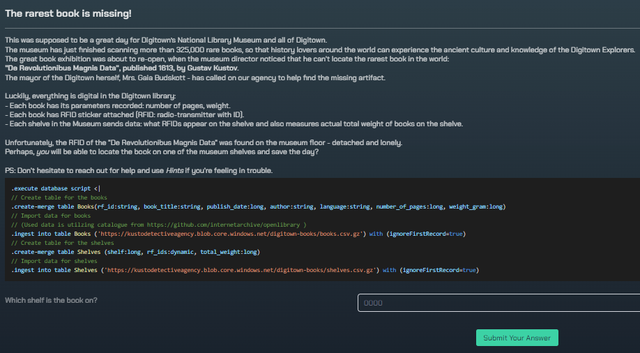

# Kusto Detective - Rookie - The rarest book is missing
## Introduction

Welcome to the actual first challenge.  Let's just say that it is expected that you have practiced since the last task. These tasks were released with a 2 week break inbetween eachother. Considering the level of the query for the first task, this one takes it even further. Not to be worried, but if you are solving this by yourself, you're in for more and more brain twisters. 

The query itself makes totally sense once you get the correct answer, but going from a logic reasoning and transferring into a query that does what you want takes practice. I will try to make these walktroughs more progressive than what the tasks may feel like.

Copy the query in the inbox text and run through it like we did in the onboarding case. It may take some time.

# The story
  

Read through the screenshot provided and get a glimpse of the story. How would yo go forward from here? For me, I have been looking for a strategy by first getting the story and then deciding on what to look for. Keywords to extract from the story:
- 325,000 rare books
- Cannot locate the rarest book in the world "De Revolutionibus Magnis Data", published 1613 by Gustav Kustov.
- Each book has number of pages and weight, RFID sticker
- RFID is collected by each shelve: which books are here and total weight.

So, basically the story is: A book has been misplaced without its RFID. Can you find it? My immediate thought to this was that we need to identify which shelve has the largest gap in weight from expected weight to actual weight. If a book has been misplaced the shelf will be heavier in total (it sends the actual weight, not the calculated RFID weight) than what the total of RFID's will tell.

My approach will then be to calculate expected weight on shelves before moving on to compare it with the actual weight, order it descending and the answer should be the top result.

Lets move on and look at the hints to learn even more of what could lead us in the correct direction.

# Hints
## First hint
  
Take a more in depth look of the book of interest. I find this as a self explanatory thing to do when starting out. Find out what kind of data you are dealing with, and see if anything stands out with the element in question. Also, you might remember a few details that can trigger any lead when doing so.

## Second hint
  
This hint proves valuable as it leads me into some queries and keywords that was interesting. The first element locks down on shelf 5853 using `where`. The `mv-expand` function takes the whole list of RFID's and creates a new row for each with their original belonging values residing in the original entry. From here we have every book with its shelf and the shelves total weight. Moving on the hint does a `lookup`. A `lookup` is similar to a `join` (it basically means to combine two tables), but has a few differences:
- like non repeating columns from the $right table, 
- limited to leftouter (default) and inner (kind of join)
- assumes $left is the larger table (oposite with join)
- automatically broadcasts the $right table to the $left table

[Microsoft has more info to dig deeper into.](https://learn.microsoft.com/en-us/azure/data-explorer/kusto/query/lookupoperator)

So, what is lookup doing here? Well, it "joins" or looks up all the information from Books and broadcasts it based on rf_id from $right to $left. And then reducing numbers of columns shown by `project`. The columns you put after this will be the columns that are being part of the output.

## Third hint
  
Nothing is perfect, ey? Dust?

# Solution
Based on everything we have gone through now, we have a query from the hints that has taken us pretty far. We've been forced to try out a few differenct functions that seem to do a lot of what we are looking for. The query we are left with is: 

```sql
Shelves 
| where shelf == "5853"
| mv-expand rf_id = rf_ids to typeof(string) 
| lookup Books on rf_id 
| project shelf, author, book_title, total_weight, weight_gram
```

What was our goal? We need to calculate the total weight of each book for each shelf and compare it to the actual weight that the shelf is claiming to have. How do we move forward? A better question is, how do we calculate on columns? Google this and see what you can figure out before moving forward!

There are a few ways to do calculations on columns' values. The solution would be to use `summarize` for this. `summarize` groups the rows based on what columns you provide after `by`. This way we can calculate and name the calculated value and make it into it's own column. 

To get the calculated weight we should `sum()` the `weight_gram` (each books weight) and we also need to create a column with the shelves claimed weight `by` shelf. Then move on to another type of calculating on columns in KQL - `extend`. `extend` does calculation and adds it into a new extended column. Subtract `claimedWeight` by `bookWeight`. Here's the solution!

```sql
Shelves 
| mv-expand rf_id = rf_ids to typeof(string)
| lookup Books on rf_id 
| project shelf, author, book_title, total_weight, weight_gram
| summarize bookWeight = sum(weight_gram), claimedWeight = min(total_weight) by shelf
| extend difference = (claimedWeight - bookWeight)
| order by difference desc
```

Or you can use another type of summarize as I've seen other players had used.:
```sql
Shelves 
| mv-expand rf_id = rf_ids to typeof(string)
| lookup Books on rf_id 
| project shelf, author, book_title, total_weight, weight_gram
| summarize bookWeight = sum(weight_gram) by shelf, total_weight
| extend difference = (claimedWeight - total_weight)
| order by difference desc
```


# Badge-time
  

Good job! Did you learn anything new? Did you prefer any of the types of summarize? Please let me know, I'd love to hear about it.