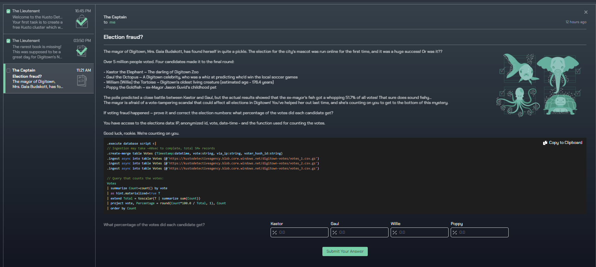
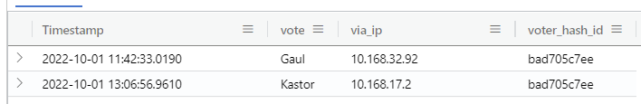
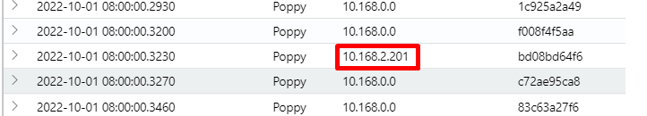
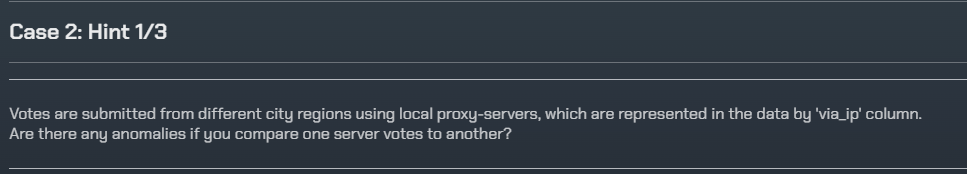
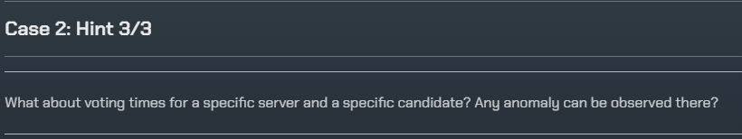
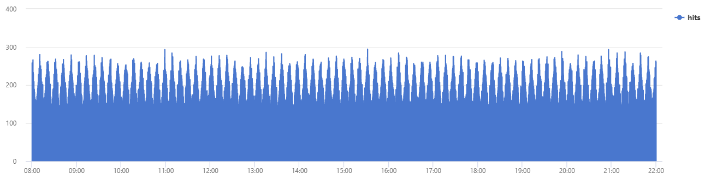

# Kusto Detective - Detective 1 - Election fraud?
## Introduction
This query moves a bit forward, and I've seen a few different ways of solving this via the community. But as far as I can tell, this is the most effective (least amount of code) way of solving it. Follow along for some of my thoughts along the way of solving. And of course, if you have any suggestions on a better code for performance - let us know!

I've added every hint at the bottom if you want to read through them and some of my thoughts on how these can be applied to the challenge. But, considering these only as optional for this task.

# The story
  

## Digging through
There may have been an election fraud. We need to decide on how, what and if this actually has taken place. We are given a query that handles the total score of each contestant, which looks like this:

```sql
// Query that counts the votes:
Votes
| summarize Count=count() by vote
| as hint.materialized=true T
| extend Total = toscalar(T | summarize sum(Count))
| project vote, Percentage = round(Count*100.0 / Total, 1), Count
| order by Count
```

This is a valid way of counting votes if nothing suspicious was present, but where should we start? Remember from the last challenge that we want to start out by looking at the data. Do this to see if anything stands out. I will definetly start by looking at Poppy, he is the one suspected of election fraud afterall.

```sql
Votes
| where vote == "Poppy"
```

Another more specific place to look for data or anomalies will be on the `voter_hash_id` as this is unique for every voter. Lets count the uniqueness of each `vote` on hash IDs and proxy (`via_ip`) and see if there are any duplicates - someone able to vote more than one time:

```sql 
Votes
| summarize num = count() by voter_hash_id, via_ip
| where num > 1
| order  by num desc 
```

No results for this, now try to remove the `via_ip` and look once more. There we have 9 entries where the same hash ID has been used to cast a vote.

  

Lets look at one of the hashes:

```sql
Votes
| where voter_hash_id == "bad705c7ee"
```

  

Not alerting at all. Is this a "bug" or by design? Not sure. It will definetly not tip one candidate above or below any other as we are dealing with votes ranging among up to a few millions. 

Lets go back to looking at only Poppy. Is there anything abnormally with the timeline?

```sql
Votes
| where vote == "Poppy"
| order by Timestamp asc
```

This is the place that got me interested when working through this. Is there anything here that seems kinda off to you? To me it was that almost every vote in the beginning starts with the firstmost IP address in a /24 range. Lets look at this and note down the times.

  

Some random entries inbetween:
  
The first entry which has a new IP address that seem to be "spamming" appears after 5 seconds. Is this a pattern?

  

It most definitely is - here's another proof:
  

My guessing so far is that the "attacker" has been using a script to ascend through the proxies, generating different voter hashes and changed IP every 5 seconds. How do we transfer this idea into KQL?

We do already have a counter query that works like a charm, but we want to exclude all entries from an IP with a count that is beyond "normal". We need to decide what is normal... Run this query:

```sql
Votes
| summarize hits = count() by bin(Timestamp, 5s), via_ip, vote
```

This query counts every entry based on the `bin()`function, `via_ip` and `vote`. `bin()` is used to group entries (rows) by `Timestamp` in buckets of 5 seconds which was the time the IP adress used to iterate to the next. This means that we will get unique entries with a counter that says how many of these matches exist based on a combination of entries per 5 seconds where `via_ip` and `vote` is unique (in combination) added to the count value. We get this result when running the query:

  

It seems that "normal" is 1 vote for the combination of the above query. A peculiarity with this query is what appears once you order it ascending by `hits`. We get a value that seems to touch every number from one and upwards. Not sure what to make of this yet - I do however have an explanation at the bottom (spoiler alert!). For now lets stick with the normal being 1 and add:

```sql
| where hits < 2
```

Now we have a complete solution to this:

```sql
Votes
| summarize hits = count() by bin(Timestamp, 5s), via_ip, vote
| where hits < 2
| summarize Count = count() by vote
| as hint.materialized=true T
| extend Total = toscalar(T | summarize sum(Count))
| project vote, Percentage = round(Count*100.0 / Total, 1), Count
| order by Count
```

# Hints
Again, we are presented with three hints that we could get one at at time:

## First hint
  

Comparing server votes can give you some hints towards correlation of timestamps and such. Try counting numbers of votes for each server where vote is for Poppy. One would think that the numbers would be more dynamic, but it sure is not. 

Another approach I've seen some people do is to use `series_decompose_anomalies` in combination with other functions. Try looking into this as well - I'm not going to cover this here, but it sure made me learn something new by reading up on this.

## Second hint
 

This hint made me also realize that the numbers for Poppy was off, really off. If you try to order ascending by count of votes on Poppy, there is a sudden spike. I tried for a long time to see if I could see a pattern in the spike, like its magnitude relating to where it originated from, and if it was as easy as dividing the number of magnitude to "get it back down". I may have been touching a possible solution, but I gave up on it.

## Third hint
  

When rendering a timechart for every vote with count based on what we saw our solution was, we can see that the attacker is pulsating for every 10 minute with a peak in votes:

```sql
Votes
| summarize hits = count() by bin(Timestamp, 5s), via_ip, vote
| where vote == "Poppy"
| order by hits desc
| project Timestamp, hits
| render timechart 
```

Which gives this output (Bypass limit for this one once asked, as it is a huge query to process):
  

Removing the two last lines of this query, you will get results that shows where and when a vote has been peeking as well as everything in between, but descending (peaks first). I struggled for a bit to make sense of these extra votes (>1) when going through these, because I was thinking "is a vote count of 15 OK?". How low a number is considered to be OK for the counter to count as a unique vote? But that was before seeing it as a pulsating attack. The lower votes are basically a part of the valleys of the peaks, either going up or going down.

# Badge-time
  
One of the details we noticed in this task is that you might try to export some of the data and visualize in applications like Microsoft Ecxel in order to point out a direction.

Good job! Did you learn anything new? Please let me know, I'd love to hear about it.