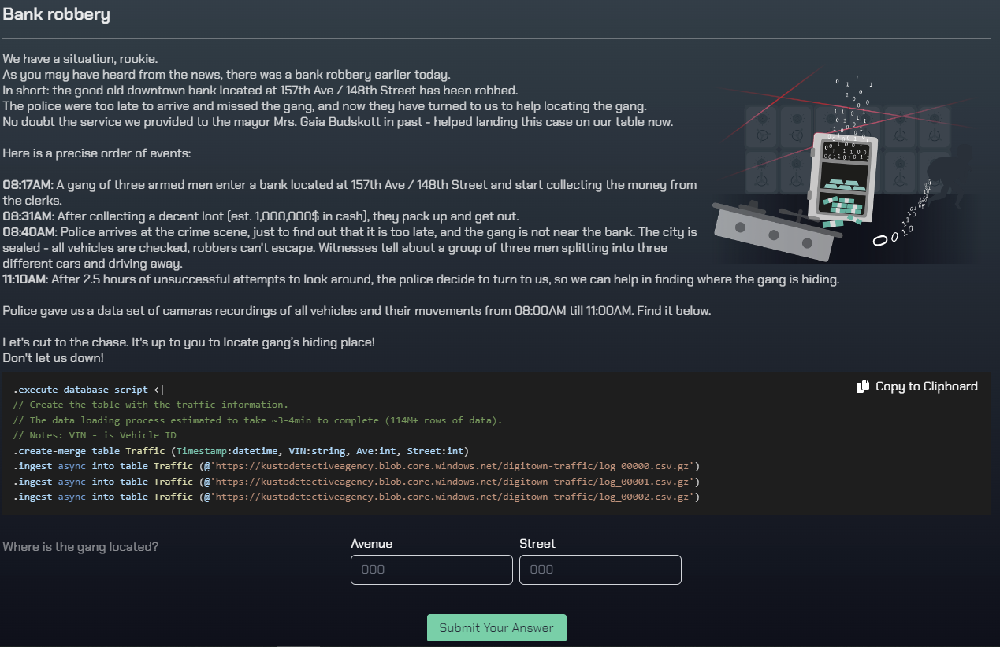
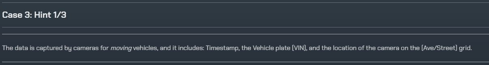
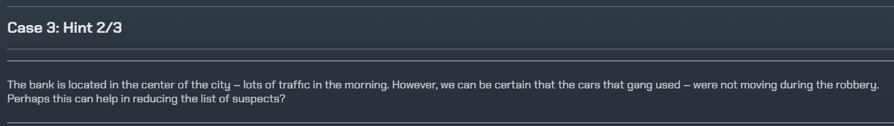
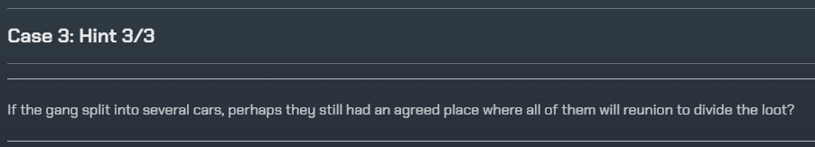
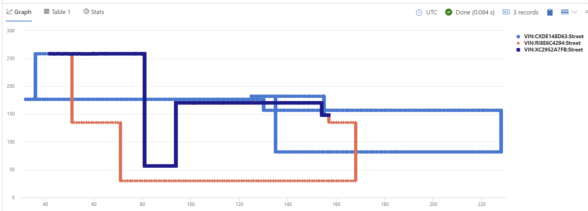
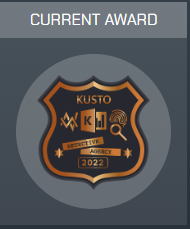

# Kusto Detective - Detective 2 - Bank Robbery
## Introduction
Moving on, we are in for a bit more tweakers. I spent a whole lot of time on this one, and I tried a lot of different approaches and queries. Minor tweaks made these queries apart from each other, until I noticed a solution that could be a lot easier than my first thoughts. Lets go through some of them. Ingest the data and get ready!

# The story
  

As you can see from the screenshot, we are dealing with a bank robbery. We are going to use our investigational skills as well as KQL skills to find out where have the robbers stopped, where can the police find them now? Every timestamp from the database are registered passings, which means that the registrations are moving cars. If you follow one car, and suddenly there are no more entries, it has stopped. Which is backed by the first hint that is provided:

## Hint 1
  

My initial thought for this challenge was to make a list of every car that is registered anywhere, create a variable that excludes cars that moved while the robbery was going on and adding in a variable where these cars has passed the correct street and avenue at any time (just to keep it more open). Starting wide, and narrowing it down is an approach I use a lot.

This idea is actually backed by the second hint in this task:
## Hint 2
  


This idea makes us enter into the creation of variables, kinda like a temporary list to check values against either for exclusion or inclusion moving forward in a pipe. To create a variable we use the `let` keyword to initialize this. Once the logic for the variable is done, you need to use `;` to finish it up. "Hey, I'm done here, and if you call me I know where to stop". We will create a variable further down.

Unfortunelately, this didnt leave me anywhere. I tried to alter and maxing out seconds for each end of the time-series. No luck, although a valid thought. The solution I ended up with was based on the idea that the cars that the robbers used had to be parked at the `Street` and `Ave`nue of the robbery when the robbery was taking place. I used this idea to create a variable that stored every car in the correct location at the absoulte end time of the robbery. 

Because the challenge states that "Here is a precice order of events:" which means that they left the bank at the earliest 08:31:00 and they were all gone before the police arrived at 08:40:00. Try running this:

```sql 
Traffic
| where Timestamp between (datetime(2022-10-16 08:31:00) .. datetime(2022-10-16 08:40:00))
| summarize arg_min(Timestamp, *) by VIN
| where Ave == 157
| where Street == 148
|summarize make_list(VIN)
```

Let's break it down. First we are asking the Traffic database for data before we check for timestamps between the two datetime types. The `..` in between the `between` keyword is called an ellipsis and often used to represent a range in programming languages. The next move is essential. We are looking for the ***first*** entry of these vehicles and then seeing which cars are at the correct location. If we had used a single timestamp, we may have missed it as it is based on moving vehicles. Then it would have been more guesswork. We ***know*** that the first place the robbers' cars are in this timegap is at the banks location. The star `*` inside `arg_min` means that we want to send all columns through the pipe and `arg_min` tells it to send the lowest (earliest) entry `by` `VIN` (read this as a normal sentence - ahh, The beauty of KQL). Next up, we are making the results into a list by summarizing it. Lets make these findings into a variable:

```sql 
let after = Traffic
| where Timestamp between (datetime(2022-10-16 08:31:00) .. datetime(2022-10-16 08:40:00))
| summarize arg_min(Timestamp, *) by VIN
| where Ave == 157
| where Street == 148
| summarize make_list(VIN);
```

Next up is pretty straight forward. We are doing some similar action, but instead of looking in a timestamp sequence where cars are first located, we are looking at the end - where they are last registered with `arg_max` and summarize it by `VIN` before we are checking the cars towards the list we created which only had cars at the right location at the right time.

```sql
Traffic
| summarize arg_max(Timestamp, *) by VIN
| where VIN in (after)
```

Concatenate these two queries and run it. There you have your answer - the `Ave` and `Street` where there are three equal entries. If we were to change the datetime between in the variable to start during or early in the robbery, the list would have been bigger, and there would have been more to look through. So, based on the "preciseness" of the data, this felt the most tuned to get a quick answer. 


## Hint 3

As we are dealing with data in a challenge and we need to pivot between lots of entries - finding that ONE car seemed like a weird thing. This is why I early on assumed that we are dealing with multiple cars. Because, when they finally stop at their hiding spot - the number will stand out. If it was one car, it would have been pretty hard to differentiate.

# Bonus
I found [this](https://www.opsman.co.za/kusto-detective-agency-challenge-3-bank-robbery/) walkthrough very interesting when deciding on writing this challenge. It shows the power of scatterchart rendering -  you may actually see the whole path of the cars involved considering the layout of the town based on a grid system. Here are the robbers' path from the end of the robbery to their end destination:

```sql
Traffic
| where VIN in ("XC2952A7FB", "RI8E6C4294", "CXDE148D63")
| summarize Ave = make_list(Ave), Street = make_list(Street) by VIN
| render scatterchart 
```

  

# Badge-time
  
Good job! Did you learn anything new? Please let me know, I'd love to hear about it.