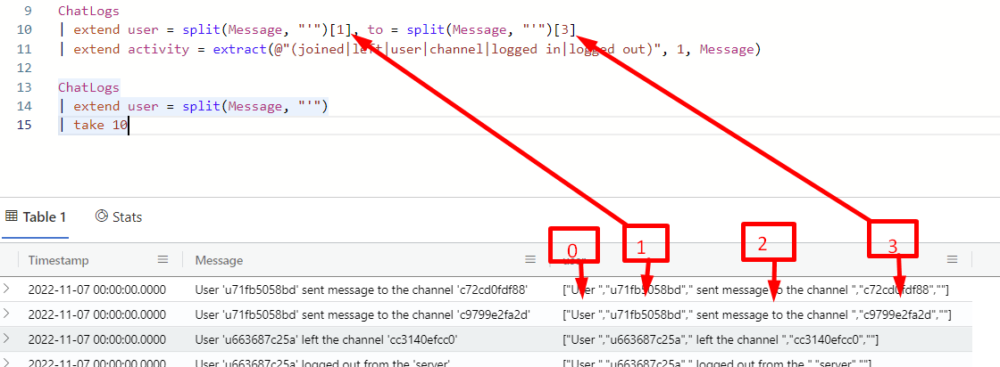
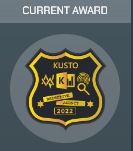

# Kusto Detective - Senior Detective - Big Heist

## Introduction
So, now that we have done the geo-location task we've learned a lot of which function resides in KQL and how to build our syntax. 

# The story
  

Ingest your data as we've done for each task by now and take a look at it. It's a pretty good idea to run `| take 10` on that kind of query, to make it respond as fast as possible.

As you can see from the data we have a timestamp and a message which consist of different types of events. Now, that is not very practical for us as analysts, as we want to treat one type of event at a time. Therefore, we need to `parse` our input. And `parse` was my initial go for this, as this is one of the main things that show up in google when searching for the obvious. Let's first take a look at how I started this task before I remembered a keyword from my tiny programming background.

`parse` is a function in KQL that parses text such that by providing it a string and telling it what part should match before turning whatever comes after it into a value in a named column. If there are multiple values in the same string, repeat this.

```sql
ChatLogs
| parse Message with "User " user " sent message to the channel " sent_to_channel
| parse Message with "User " user1 " left the channel " left_channel
| parse Message with "User " user2 " logged out from the " logged_out_from
| parse Message with "User " user3 " joined the channel " joined_channel
| parse Message with "User " user4 " logged in from " loginIP
| parse Message with "User " user5 " sent message to the user " sent_to_user
| extend TheUser = strcat(user, user1, user2, user3, user4, user5) 
| project-away user, user1, user2, user3, user4, user5
```

Putting this into the context of the brief explanation over, we are parsing the `Message` for each line that we can see that is different from another. Starting with the first one the `user`-ID is what comes after "User " (notice the space), this will be stored into `user`. 

The line continues with " sent message to the channel " (notice the spaces) and the value at the end of the line is stored into `sent_to_channel`, which name is descriptive of what action this line is referencing. Repeat this explanation for each of the `parse` line. 

At the end, we create a new column with `extend` called `TheUser`, and we are adding each of the `user`* to that column, and to make this a possibility we need to add it by concatenating it as a string which we do with `strcat()`. And then we remove the `user`* columns with `project-away`.

The reason we want to parse this text is to make our life easier when working on a query that makes sense towards the end goal.

This is lot of code to parse something simple. There has to be a better way. And there is. Read a few of the lines in `Message` once more. Every value we are looking for are inside single quotes. We can use this to split the string and retrieve what we want.

We have the option to use, as far as my research has gone, either `extract()` to get our values based on regex, or we could use `split()`. Or maybe even both just to get them both under our nails to learn them.

```sql
let logs = ChatLogs
| extend user = tostring(split(Message, "'")[1]), target = tostring(split(Message, "'")[3])
| extend activity = extract(@"(joined|left|user|channel|logged in|logged out)", 1, Message);
let joiners = logs
```

Wow! We reduced our first query from 9 lines to 3 and with a better and more readable query and output. If the regex on line 3 seems off it basically means that if any of these values exists in the current line then that will also be the value of the outputting column. 

Now, user and channel are not descriptive as an `activity` but they had similar line structure and words, and `user` and `channel` was the only part in them made sense to use. Think of it as an action towards both `user` and `channel`. To make sense of the split function, we are inputing `Message` and splitting it based on single quotes before choosing which index we need for it. Try outputting this query if you struggle to understand it:

```sql
ChatLogs
| extend user = split(Message, "'")
| take 10
```



As you can see, the single quotes has dissappeared in the extended column, that is because we used them to make a split in the line. The output gets converted to a list.

We have until now created a great representation of our data. In these kinds of tasks we need to make some kind of assumptions, like how does criminals work and act, to get moving on. These may take you in any direction, and to be honest, I've tried quite a few going through this task.

### Hint 1
  

So our first thing here is to align the wordings. Maybe "activity" should be renamed "action"? Let's do that. 

Let's make our first assumption, like the hint tells us to. Based on the data we have been delivered we have people joining, leaving, logging in/out etc. What this tells me is that the gang-members might have a policy on how long they are allowed to stay online, or that they need to log in and out each time, join/leave... 

This is what made me believe that by grouping actions into bins, and probably into a short time-limit will give me some kind of answer - or maybe just reduce my data to get me going further.

```sql
let joiners = logs
| where action == "joined"
| summarize ts = dcount(tostring(user)) by bin(Timestamp, 1m), target
| where ts == 4
| distinct target
| summarize make_list(target);
```
What is this? Well, here we are looking for everyone that has `joined` a channel before we count every unique `user` based on a grouping of time (`bin()`). Now, this is kinda guesswork, and I ran this query until that stage to see which timeunit left me with the least amount of answer. I could have been wrong, but I kept going with this, as the logic still made sense to me. 

This line is then counted by the `bin()`and `target`. We know the gang consists of 4 members - this count is stored in `ts` basically a var name short for `timestamp` - name it anything you want. Ending it up, we remove duplicates by the `distinct` function on target before we make it into a list, which is easier to work with in my opinion (bad habit?). This left me with two different channels. I struggled a bit to see how I could differentiate these two channels. 

Worst-case-scenario would be to try out 8 different users, 4 for each channel. Or would it? Do I know that each of these two channels has 4 members? No, I dont. By looking into how many members these channels has I was able to see that one channel had multiple members, but (by design?) they are being added to match this criteria up until now. Which means, that we are actually not counting 4 members in this variable, we are counting 4 members that has joined this minute. They may leave, and new members may join the next minute etc. Therefore, we need to find distinct users and count them to four.

```sql
let crimChannel = logs
| summarize c = dcount(user) by target
| where c == 4 and target in (joiners)
| summarize make_list(target);
```

Here we are counting distinct `user`s by `target`, filtering out channels with only 4 members and where they are part of the list in `joiners`, before making it into a list.

```sql
let crimUsers = logs
| where target in (crimChannel)
| distinct user
| summarize make_list(user);
logs
| where action == "logged in" and user in (crimUsers)
| distinct target
| project strcat("https://sneakinto.z13.web.core.windows.net/", target)
```

In this last bit, we are using the output of the previous to find the users who belongs to a channel, and look at all entries where `action` equals `"logged in"`. 


### Complete Query
```sql 
let logs = ChatLogs
| extend user = tostring(split(Message, "'")[1]), target = tostring(split(Message, "'")[3])
| extend activity = extract(@"(joined|left|user|channel|logged in|logged out)", 1, Message);
let joiners = logs
| where activity == "joined"
| summarize ts = dcount(tostring(user)) by bin(Timestamp, 1m), target
| where ts == 4
| distinct target
| summarize make_list(target);
let crimChannel = logs
| summarize c = dcount(user) by target
| where c == 4 and target in (joiners)
| summarize make_list(target);
let crimUsers = logs
| where target in (crimChannel)
| distinct user
| summarize make_list(user);
logs
| where activity == "logged in" and user in (crimUsers)
| distinct target
| project strcat("https://sneakinto.z13.web.core.windows.net/", target)
```

### Hint 2
  
Nope, not having any trouble, thanks anyways.

The query we have made printed the different links we needed to input into the URL from the Kusto Dashboard inbox:

- https://sneakinto.z13.web.core.windows.net/236.48.237.42
- https://sneakinto.z13.web.core.windows.net/119.10.30.154
- https://sneakinto.z13.web.core.windows.net/146.49.19.37
- https://sneakinto.z13.web.core.windows.net/194.243.69.176

The rest of this challenge is not that KQL-filled. I'll therefore focusing on the steps that leads us to a solution instead of all the investigational steps. I suggest however that you do some investigation yourself to see if you can continue from here.

At first, we can see that each one of the links contains some files. The `utils.txt` is interesting:

```sql
    // Handy utils

    // 1) Utility to discover secondary messages.
    // Usage: ReadMessage(Message, Key)
    let ReadMessage = (Message:string, Key:string) 
    {
        let m = Message; let K = Key; let l = toscalar(print s = split(split(K,':')[1], ',') | mv-expand s | summarize make_list(tolong(s)));
        let ma = (i1:long, i2:long) { make_string(repeat(tolong(l[i1])-tolong(l[i2]), 1))}; 
        let ms = (d:dynamic, s:long, e:long) { make_string(array_slice(d, s, e)) };   
        let mc = m has '...';
        print s=split(split(replace_regex(m, @'[\s\?]+', ' '),substring(K,9,3))[1], ' ')
        | mv-expand with_itemindex=r s to typeof(string) | serialize 
        | where r in (l)
        | extend s = iif(r-1 == prev(r), replace_string(strcat(prev(s), s),'o','ou'), s)
        | where (r+1 != next(r))
        | summarize s=strcat_array(make_list(s), iff(mc, '+%2B', ' '))
        | extend k = series_subtract(series_add(to_utf8(K), l), repeat(23, 10))
        | project result=iif(mc, strcat(ms(k,0,3), ma(8,2), ms(k,4,6), ms(l,8,8), ms(k,7,7), ma(8,0), s), s)
    };
    ReadMessage(
    '''
    Hi there! How are you?

    PS: 
    This is a nice utility that reveals what hidden messages the text may have.
    We may read the message and think: is there anything beyond words?
    Can we find it without the utility, or it will become too much of a headache?
    ''',
    h@'dhkl4fva!that:2,9,15,22,31'
    )

    // 2) Get GEO location from images:
    // Use https://tool.geoimgr.com/
```

There is also a link to this site: https://news.microsoft.com/innovation-stories/project-natick-underwater-datacenter/

This image:
  

Use the geoimgr.com link from the utils.txt message and import `image3.jpg` to get the correct latitude and longitude we need for the task.

### Hint 3
  

Using the key from task 4 should probably be our go-to! Let's move on!

Copy the whole `utils.txt` message into ADX and run it. This is utility to decrypt a hidden message. Now, finding the text to decrypt was a really painful task. Finally I found out that by decrypting the message in the dashboard of the last task starting with: "PS:..." - I got a link to bing.com(PS: remember to include the function as well.):

    ReadMessage(
    ```
    PS:
    Feeling uncomfortable and wondering about an elephant in the room: why would I help you?
    Nothing escapes you, ha?
    Let’s put it this way: we live in a circus full of competition. I can use some of your help, and nothing breaks if you use mine... You see, everything is about symbiosis.
    Anyway, what do you have to lose? Look on an illustrated past, fast forward N days and realize the future is here.
    ```,
    h@'wytaPUJM!PS:2,7,17,29,42,49,58,59,63'
    )

Go to the link: bing.com?q=uncomfortable+%2Belephant+%2Bescapes+%2Bcircus+%2Bbreaks+%2Beverything+%2Btoulouse+%2Billustrated and enter into the first search result.

Now, two other hints that I used a lot of time to correlate between was the content of the link and how to use it. Reading through the email in the screenshot above gave me some clue. Read the `message-project-x.png` from one of the sneakinto websites. So, we need the date of the Project X image as well.

Now, get the date of the projext X image (view creation date of the file you downloaded), the year of elephant image and plot them into the algorithm:

```sql
print make_datetime(2020, 07, 09) + (1891d % 1000d);
```

We are using the algorithm inside KQL here. We set the date of the ProjectX in `make_datetime()` and then we add the modulation between the two numbers and set their data types to `d` (days) which makes it able to do calculations on dates/times.

When plotting each of the answers in - note the length of each answer. Do you need to round any number up or down?

NOTE! There was some issue with the lat and long input - it had been switched around. Try to switch if you fail on delivering the first time. Your answer is most likely correct.

# Badge-time


Want another badge? Plot the answer in once more. As you can see, the checkmark on the inbox message of this task is not checked. Confirm your answer and get a completion badge!


Good job Senior Detective! Did you learn anything new? Please let me know, I'd love to hear about it.