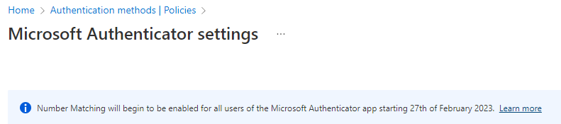

# Konfigurasjonskontroll for økt sikkerhet i skyløsninger – del 3

Som nevnt i [del 1](https://blog.amestofortytwo.com/konfigurasjonskontroll-for-okt-sikkerhet/) og [del 2](https://blog.amestofortytwo.com/konfigurasjonskontroll-for-okt-sikkerhet-del2/) av denne artikkelserien er det stadig endringer i gjeldende anbefalinger for Multifaktor Autentisering (MFA). Disse anbefalingene er basert på en kombinasjon av trusselbildet vi står ovenfor, samt tilgjengelig funksjonalitet i sikkerhetsløsningene som benyttes. Denne artikkelserien tar utgangspunkt i identitetsløsningen Azure AD som stadig forbedres for å møte disse utfordringene: 

Det er spesielt fire funksjoner som forbedres rundt dette nå:
- Authentication Strenghts
- Authentication Methods
- Self-Service Password Reset
- Company Branding

Alle disse henger sammen, og alle har stor innvirkning på sikkerhetsnivået, men like viktig; de påvirker brukeropplevelsen. Dette er viktig å ikke glemme.

**Noen råd i denne forbindelse**:

	• Start tidlig med test av dette for å skaffe erfaringer og legge en plan
	• Start gradvis med noen få brukere, utvid til en større pilotgruppe før man endrer for alle brukere
	• Involver servicedesk og lag gode rutiner for hvordan de kan håndtere ulike scenarioer
	• Involver HR eller personal og start tidlig med informasjon og brukeropplæring, gjerne i form av enkle videoer e.l. 

	
Microsoft har laget en veiledning for migrering fra "legacy MFA og SSPR" til den oppdaterte Authentication Methods konfigurasjonen. Samtidig har Microsoft varslet at de vil begynne å endre standardoppsettet for brukere av Microsoft Authenticator app til Passwordless med Number Matching. Dette starter allerede **27.02.2023**: 

 *Les mer om dette her*: [Protecting authentication methods in Azure Active Directory - Microsoft Entra | Microsoft Learn](https://learn.microsoft.com/nb-no/azure/active-directory/authentication/concept-authentication-default-enablement)
 
 Se også følgende samling med materiale fra Microsoft som kan brukes som del av opplæring og informasjonskampanjer internt i organisasjonen: [Microsoft Entra end-user rollout templates and materials](https://aka.ms/mfamails)

Jeg vil også anbefale å følge med på **CISA** sine anbefalinger. Selv om de i noen scenarioer kan være litt "voldsomme" for små- og mellomstore bedrifter i Norge, gir de en pekepinn og noen gode føringer omkring hva man bør tenke på. CISA: [CISA Releases Guidance on Phishing-Resistant and Numbers Matching Multifactor Authentication](https://www.cisa.gov/uscert/ncas/current-activity/2022/10/31/cisa-releases-guidance-phishing-resistant-and-numbers-matching) 

Jeg liker veldig godt CISA sin tilnærming der de sterkt anbefaler phishing-resistant MFA for administratorer og andre "high-value targets"; være seg utsatte personer i ledergruppa eller personer med tilgang til sensitive data. 

Videre er det viktig å vurdere ekstra sikring av det Microsoft kaller Workload Identities, også kjent som Service principals eller tjenestekontoer på godt norsk. Igjen må man vurdere hvilket nivå man skal legge seg på for sikring av disse uten at det går på bekostning av produktivitet, men i tråd med Zero Trust og Assume Breach er man aldri sterkere enn det svakeste leddet.

Kilder og referanser:
[How to migrate MFA and SSPR policy settings to the Authentication methods policy for Azure AD](https://learn.microsoft.com/en-us/azure/active-directory/authentication/how-to-authentication-methods-manage)

[Updated Company Branding for sign-in experiences in Azure AD](https://techcommunity.microsoft.com/t5/microsoft-entra-azure-ad-blog/introducing-enhanced-company-branding-for-sign-in-experiences-in/ba-p/3094110)

