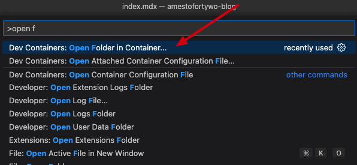
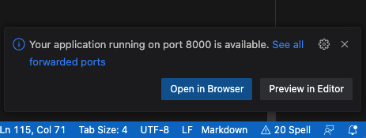

# How to setup
In order to provide a straightforward method for our engineers to add new blog posts to our Gatsby blog (here), I decided to experiment with [Visual Studio Code Dev Containers](https://code.visualstudio.com/docs/devcontainers/containers) After trying it out, I can confidently say that it is a fantastic tool!

Visual Studio Code Dev Containers allow developers to work in a fully-featured development environment, regardless of their local setup. This makes it easy for our engineers to update our blog, as they can do so within a consistent and reliable environment.

Overall, I was extremely impressed with the ease of use and functionality of Visual Studio Code Dev Containers. I believe it will be a valuable tool for our team.

Our blog is built on [Gatsby](http://gatsbyjs.com) with [A theme from Pitayan](https://github.com/remiks/gatsby-theme-pitayan)

Let us jump into how I configured this.

## Pre prerequisites

You need Docker desktop and vscode installed on your system. Follow the quick setup guide [here](https://code.visualstudio.com/docs/devcontainers/tutorial)

## 1. Create folder structure

First create a folder named `.devcontainer` in your Gatsby root directory. 

## 2. Create devcontainer.json

Create a new file named `devcontainer.json`

This config will also install necessary extensions in your vscode instance to work better with markdown. 

```sh
// For format details, see https://aka.ms/devcontainer.json. For config options, see the
// README at: https://github.com/devcontainers/templates/tree/main/src/javascript-node
{
	"name": "Fortytwo Blog container",
	
	// The image to use for the container, in this case a JavaScript Node environment
	"image": "mcr.microsoft.com/devcontainers/javascript-node:0-18",

	// A volume mount for the node_modules folder to persist across container restarts
    "mounts": [
		"source=${localWorkspaceFolderBasename}-node_modules,target=${containerWorkspaceFolder}/node_modules,type=volume"
	],

	// A list of ports to forward from the container to the host machine
	"forwardPorts": [
		// Port for the Gatsby server
		8000,
		// Port for the Live reload server
		8000
	],

	// A command to run after the container is created
	"postCreateCommand": "sh .devcontainer/post-create.sh",

	// Customizations specific to the VS Code editor
    "customizations": {
        "vscode": {
          "extensions": [
            "yzhang.markdown-all-in-one",
            "DavidAnson.vscode-markdownlint",
            "bierner.markdown-emoji",
            "streetsidesoftware.code-spell-checker"
            ]
        }
    },

	// Option to run the container as the root user (uncomment to use)
	// "remoteUser": "root"
}
```

## 3. Create post-create.sh file

I am using a simple `post-create.sh` file to have more control of the commands that I want to run after the container has started.

```bash
#!/bin/sh

# Jump into correct folder
cd /workspaces/amestofortywo-blog

# Install Gatsby CLI
sudo npm install -g gatsby-cli

# Setup and install prereqs 
sudo npm install

# Increase node memory allocation
export NODE_OPTIONS="--max-old-space-size=5096"

# Wipe all cache node_modules and package-lock.json file
gatsby clean

# Run development instance
gatsby develop
```

## 4. Open container

Now, open your project in vscode and choose 



You container should start building now, first time it will take some time. Next time it will connect right away!

> vscode will actually let you know when the site us up and running. :D 



## 5. Browse and build

Your Gatsby site should now be available on `http://localhost:8000/` and reload everytime you write something in vscode.

## Extra: The button

Oh, it is also possible to add a button to you repo that automatically clone and opens everything in vscode for you

[](https://vscode.dev/redirect?url=vscode://ms-vscode-remote.remote-containers/cloneInVolume?url=https://github.com/amestofortytwo/blog)

> NB: I do have some difficulties passing Github SSH keys to the container because im using 1Password for mye keys. Cloning and using HTTPS from Github should work better until I figure this one out. [Read more here](https://code.visualstudio.com/remote/advancedcontainers/sharing-git-credentials)

## Conclusion

Setting up Visual Studio Code Dev Containers for a Gatsby blog is a straightforward process that can greatly benefit a team of engineers. The Dev Container offers a consistent and reliable environment for developers to work in and eliminates the need for a locally set up environment. With the steps outlined in this blog post, you can easily set up Dev Containers for your own Gatsby blog of whatever you want to develop.