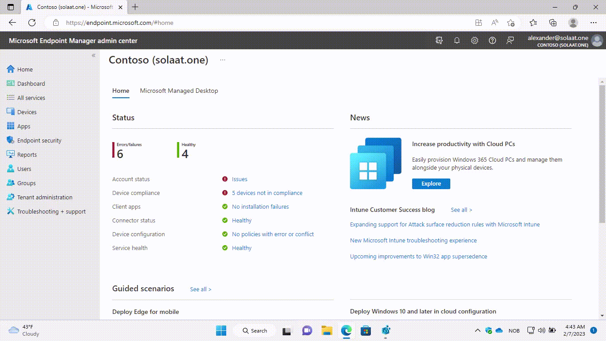

# Managed Intune
Microsoft er på ingen som helst måte alene, nettsider, grensesnitt og administrasjonsportaler oppdateres, slås sammen, splittes eller får nye navn. Intune er nærmest et skoleeksempel og har fått ny portal ikke mindre enn tre(!) ganger. Å holde oversikten innad i den nåværende portalen kan være en utfordring i seg selv og endringstakten er ikke ventet å avta med det første.

Faktum er at det kan være like kostbart for en liten bedrift å holde seg oppdatert på verktøyet, som det er for en stor organisasjon. Selv om en stor organisasjon kan ha større budsjetter til teknologi kan teknisk gjeld og kompleksitet i løsningen sluke investerings- og opplæringsbudsjett. Det blir ikke billigere, enklere eller ryddigere dersom organisasjonen har flere tenants og Intune- miljøer å drifte i hverdagen.

## Mulighetene for å strømlinjeforme og forvalte flere tenants under en paraply.
Den glidende overgangen og forståelsen over hvordan klienter gir en god brukeropplevelse, samtidig som den beskytter både den ansatte, virksomheten og informasjonen er under stadig utfordring når vi flytter fra det «gamle til det nye».

Det kan være vanskelig å overbevise etablerte it personer hvordan komplekse regelsett, konfigurasjoner og oppstarts-skript enkelt erstattes med konseptet «less is more». Den gamle skolen lærte at streng styring på operativsystemet var den eneste nøkkelen til sikkerhet, alternativet kan virke ulogisk og farlig. 

Virkeligheten er at dersom du gjør løsningen for begrenset eller regelrett brukerfiendtlig kan dette føre til at ansatte søker alternative måter å utføre arbeidsoppgaver på. De vil kanskje begynne å bruke enheter eller tjenester som ikke er innarbeidet av organisasjonen, men som de mener vil hjelpe dem med å utføre arbeidsoppgaver mer effektivt. Dette er gjerne enheter og tjenester som IT ikke kan låse ned, og du har rykket tilbake til start. I ytterste fall kan dette føre til at organisasjonen mister kontroll over informasjonssikkerhet og dataoppbevaring.  Datamaskinen blir en (ubrukt) fiende for den ansatte, mens den private mobilen forblir flittig i bruk og like usikret.

## Hvordan managed Intune kan bistå innen samhandling og samarbeid
Oppkjøp, utskillelse, opprettelse av datterselskap eller kommune- og fylkessammenslåinger - hvem vil ta vare på det gamle - og er det mulig i skyverdenen?

> Javisst er det mulig. Det kan også være lurt dersom driftsorganisasjonen har aktivt forvaltet løsningen over tid. Her er det gode muligheter for «do once, deploy twice”. Alternativet kan være tidkrevende og fordyrende. Managed Intune gir rom for både ressursoptimalisering og spesialisering.

## Managed security posture – managed Intune
Å konfigurere sikring av  Azure- databaser og key-vaults er bra, men det hjelper ikke hvis du ikke har en oppdatert klientpark eller implementert beskyttelse mot tap av data. En utdatert compliance-policy kan bidra til at sterkt utdaterte klienter uten sikkerhetsoppdateringer gis tilgang. 
Compliance er mer enn bare Intune – det er ett av mange security intelligens signaler som benyttes for å gi eller blokke tilgang til systemer og informasjon. Det er samtidig en nøkkelverdi for en god og sikker anvendelse av conditional access regler.
I tråd med modernisering og fokusskifte benyttes stadig «less is more» som begrep. Det betyr ikke frislipp eller fravær av kontroll. Det betyr at ikke alle sikkerhetskonfigurasjonene spres i henholdt til «zero-trust» prinsippet. Sikringen utføres ikke på et fåtall plasser, men heller litt over alt. 
Med managed security posture blir Intune en av de mange bestanddelene som blir overvåket og anbefalinger for konfigurasjon skjer i samråd med tenantens øvrige konfigurasjon – eller for seg selv.

## Hvorfor Fortytwo?
Det er mange fordeler med å velge Managed Intune fra Amesto Fortytwo.

### Kompetanse
Amesto Fortytwo har bred og lang erfaring med å implementere og drifte Intune for organisasjoner. De har kunnskap om plattformens funksjoner og fordeler, og kan hjelpe deg med å optimalisere løsningen for din virksomhet.

### Sikkerhet 
Managed Intune gir robust sikkerhet og kontroll over enheter og data. Amesto Fortytwo har erfaring med å håndtere sikkerhetsutfordringer og kan hjelpe deg med å beskytte informasjonen din.

### Effektivitet
Managed Intune kan øke produktiviteten ved å tillate enheter å fjernarbeide og samarbeide enklere. Amesto Fortytwo har kunnskap om hvordan løsningen kan brukes for å maksimere effektiviteten i din virksomhet.

### Skalerbarhet
Managed Intune kan enkelt tilpasses virksomheter i alle størrelser og bransjer. Amesto Fortytwo har erfaring med å implementere løsningen for organisasjoner i mange forskjellige bransjer og kan hjelpe deg med å velge den beste tilnærmingen for din virksomhet.
