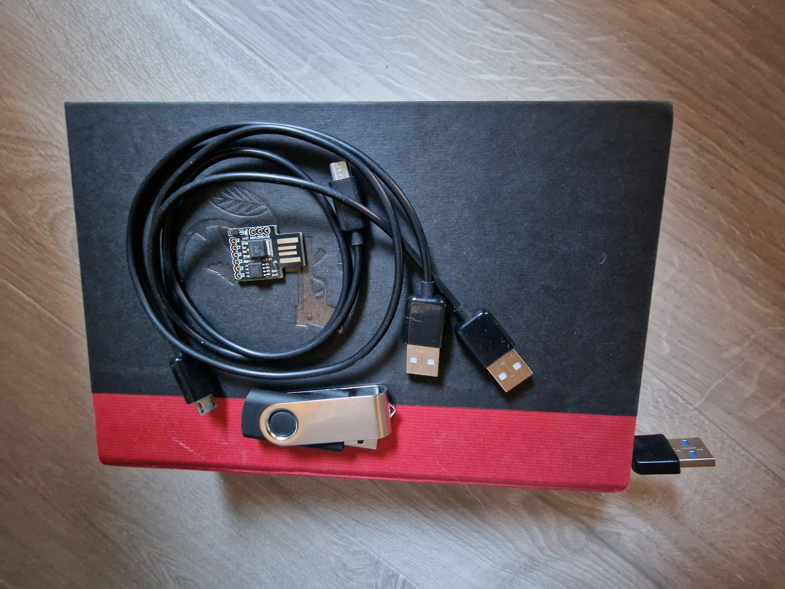
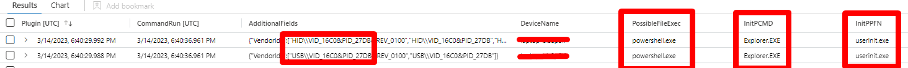

# Introduction
USB drives are essential tools for storing and transferring data, but they can also be used as a weapon in a cyber attack. In this blog post, we will explore a few options attackers can choose to craft a malicious USB drive and the potential consequences of such an attack. 

## What is a malicious USB?
A malicious USB is a USB that looks normal but acts bad. It is capable of typing on an emulated keyboard at the speed of light! USB devices have become an essential part of our daily lives, allowing us to transfer data quickly and easily from one device to another. However, not all USB devices are created equal. Malicious USB devices have become increasingly popular, and the consequences of plugging in an untrusted device can be severe.

A malicious USB device can come in many different shapes and forms. Some are designed to look like ordinary USB drives, while others may be disguised as other devices such as keyboards, mice or books (as the title image). The goal is to lure unsuspecting victims into plugging the device into their computer or come close to an unlocked computer with a hidden USB, giving the attacker access to their system.

One popular technique used by attackers is to create a device that looks like it contains personal information belonging to someone else. For example, in the TV series Mr. Robot, a character places a USB drive containing a fake resume in a parking lot. When an unsuspecting victim picks up the drive and plugs it into their computer, the attacker gains access to their system.

But how do these devices work, and why are they so powerful? The answer lies in how computers trust USB devices. To use a computer normally, we need a keyboard to type on or a mouse to navigate. The computer trusts these devices to be legitimate and assumes that anyone with physical access to the computer is authorized to use them. Malicious USB devices take advantage of this trust to gain access to the system. By emulating a keyboard, the device can "type" commands into the computer, allowing the attacker to execute code or steal data. Because the device is seen as a legitimate input device, the computer doesn't question its actions, making it an effective tool for attackers.

Although some vendors has tried to mitigate this by only allowing certain types of VIDs and PIDs, these are easily spoofable. [Take a look here](https://ducktoolkit.com/vidpid) how easy it may be to change VID and PID for Rubber Ducky. [Here](https://null-byte.wonderhowto.com/how-to/hack-macos-with-digispark-ducky-script-payloads-0198555/) is a bit more job for the Digispark.

To protect yourself from malicious USB devices, it's important to follow a few simple rules. First and foremost, never plug in an untrusted device or one that you don't know where it came from. Always be wary of USB devices that you find in public places, as they may be designed to trick you into plugging them in.

Secondly, make sure to sign out of your computer when you're done using it. This will help prevent unauthorized access by anyone who gains physical access to the device.

## The basics of crafting a malicious USB drive

There are several ways to get your hands on a malicious USB, the most popular is by far the Rubber Ducky by Hak5. These are commercially produced and uses a simple and easy to understand language that translates into keyboard presses. Easy to understand, easy to deploy and use.

The last few years there has been an increase in malicious cables, at least from my observations. The cable acts like a rubber ducky but looks like your normal USB charger cable. 

Another approach is to create one yourself using popular microcontrollers like the Arduino. There are certain requirements for these microcontrollers to emulate a keyboard but aiming for an Arduino Leonardo you are already there in terms of chipset that has this emulation feature (there are dozens of types and sizes, the Leonardo is kinda huge in size).

Way back when I started researching the topics of malicious USB's I made one myself that was able to be used regardless of the OS I wanted to attack. To achieve this, it had a few buttons, 3x2. Where the first row of buttons was for OS (Windows, MacOS and Linux), the next row was for filetypes to extract (text/documents, videos and pictures). Pressing a combination of OS button and filetype button, a command was typed at the speed of inhuman which triggered files files to be sent to a USB storage located in the same hub as the Arduino. I also added a potentiometer to be able to change the delay between each emulated keyboard press. This would enable me to use it on older slower computers as well.


And here are a few of the different devices in my collection, for your reference.


## Let's go hunting

Microsoft has made it easy to hunt for USBs in Sentinel using KQL. Entering into the ```DeviceEvents``` table, we get access to a lot of information ranging through most of the action types that might lead us to detecting a malicious USB device. Some of which are:
- PnpDeviceConnected
- PnPDeviceAllowed
- UsbDriveMounted
- UsbDriveUnmounted
- UsbDriveLetterChanged

But making it easier doesn't mean it's easy. Attackers always look for ways to hide their steps, and by changing and spoofing the USB PID and VID (Product ID and Vendor ID) they make it harder to be detected. Hunting for these values is by far the most effective way, this also means that there is an additional step in creating such a malicious USB to avoid being detected. I finally resorted into this approach as I tried quite a few different approaches into detecting the few scripts I was running on my device. First of all, I tried to look at the ```UsbDriveMounted``` and set a timegap between that and ```UsbDriveUnmounted``` to look for all process creations and PowerShell commands created during that connection time. But as you may suspect, that proved ineffiecient. It yielded a result not worth my time to dig through. I tried a few variations of this before I saw that I need to filter on known or potentially malicious VIDs and PIDs. And then I found a great resource to go look for such devices based on what kinds of microchip they have (link on top of the query). Not all microchips have the ability to emulate a keyboard - those who do, may be used in these types of attacks. Here is a beginning to list all of these types of devices: 

```csharp
// A great tool to add to this query: https://devicehunt.com/view/type/usb/
let known_suspicious = dynamic(["VID_03eb", "PID_2401"  // Atmel
                            , "VID_16D0", "PID_0753"    // Digispark
                            , "VID_16C0", "PID_0483"    // Teensyduino
                            , "VID_2341"                // Arduino https://devicehunt.com/view/type/usb/vendor/2341
                            ]); 
DeviceEvents
| mv-expand AdditionalFields
| where AdditionalFields["VendorIds"] has_any (known_suspicious)
```
What we are doing here, we list known VIDs and PIDs and then do a check on those from the DeviceEvents. Next up we will add ```DeviceProcessEvents``` to look for any processes that **might** be connected and **might** be malicious in nature. This will not show you any parameters of any commands that has been run, but seeing either "cmd.exe", "powershell.exe" or "conhost.exe" should raise some flags as these are, as you know, the gateway to the vault!


---
Keep in mind that all the output of a query are just data. Your job is to make sure you understand and correlate these data with actual wrongdoing! Use your findings to decide whether or not to dig deeper into a device or a user.
---

Moving on to the complete query:
```csharp
// A great tool to add to this query: https://devicehunt.com/view/type/usb/
let known_suspicious = dynamic(["VID_03eb", "PID_2401"  // Atmel
                            , "VID_16D0", "PID_0753"    // Digispark
                            , "VID_16C0", "PID_0483"    // Teensyduino
                            , "VID_2341"                // Arduino https://devicehunt.com/view/type/usb/vendor/2341
                            ]); 
DeviceEvents
| mv-expand AdditionalFields
| where AdditionalFields["VendorIds"] has_any (known_suspicious)
| join kind=inner (
    DeviceProcessEvents
    | where ProcessCommandLine != ""
    | extend CommandRun = TimeGenerated
    ) on DeviceId, DeviceName
| where CommandRun between (TimeGenerated .. 10s) // Time from plugin to action
| where InitiatingProcessParentFileName1  has_any ("userinit.exe", "explorer.exe") // User initiated - non system actions
| project Plugin=TimeGenerated, CommandRun, AdditionalFields, DeviceName, PossibleFileExec=FileName1, InitPCMD = InitiatingProcessCommandLine1, InitPPFN = InitiatingProcessParentFileName1, InitPPID=InitiatingProcessParentId1, PID=ProcessId1
```

Another approach or an addition to this approach would be to use this ```DeviceEvents | where ActionType == "PowerShellCommand"``` and then filter on a list of known potential malicious PS modules, but for my testing thus far the one provided on top yielded the most accurate answer as cmd and powershell were the ones I initiated through my different USBs as well as opening those application through the startmenu, which is indicated by the explorer.exe.




Consider this blog entry as a possible way to hunt for these devices. Attackers will always be a step ahead and by combining multiple approaches you might be able to defend pretty well against most types of attacks. By seeking answers only in a few places, you leave yourself and your systems pretty vulnerable. 

Feel free to give feedback on this post as well as adding in different PIDs and VIDs you know that are missing.

--- 
Looking for extra resources on learning KQL? Take a look here: [KQLcheat](https://kqlcheat.byfortytwo.com)


## Further reading:
[Jeffrey Appel - Manage device Control with Defender for Endpoint and Endpoint Manager](https://jeffreyappel.nl/manage-device-control-with-microsoft-defender-for-endpoint-and-endpoint-manager-part-1/)
[In need of a rabbot hole on USB serial numbers?](https://www.sans.org/blog/the-truth-about-usb-device-serial-numbers/)
[Find the USB history in registry](https://www.cybrary.it/blog/0p3n/usb-forensics-find-the-history-of-every-connected-usb-device-on-your-computer/)
[USB storage forensics](https://web.archive.org/web/20210126041721/https://forensixchange.com/posts/19_08_03_usb_storage_forensics_1/)
[Block USB in MS Defender for Endpoint and Intune](https://techcommunity.microsoft.com/t5/manufacturing/block-usb-in-microsoft-defender-for-endpoint-and-intune/ba-p/3040817)
