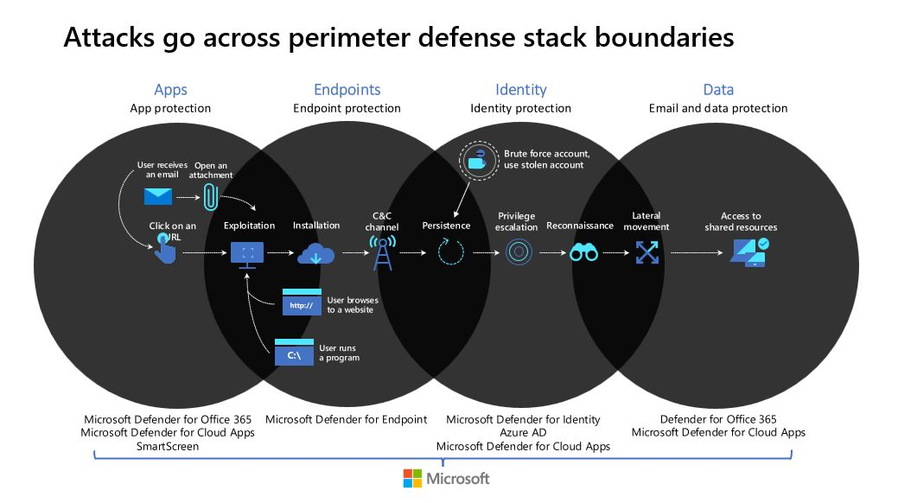

# Microsoft Defender Suite: Comprehensive Cybersecurity for Today's Digital Landscape

The Microsoft Defender suite is a powerful security solution that provides protection for various attack vectors in an organization's digital infrastructure. The suite comprises several tools that work together to defend against cyber threats at various stages of an attack chain.

Defender for Office 365 is a feature-packed tool that helps protect against phishing attacks by identifying and blocking malicious links and attachments in emails. It also offers features like Exchange Online Protection, real-time reports, and Safe Attachments, which scan email attachments for malware and other threats before they reach the recipient.

Defender for Cloud Apps provides enhanced security for cloud-based applications and services, such as Microsoft Office 365, against various cyber threats. It offers features such as advanced threat protection, anomaly detection, and real-time monitoring of user activities to detect and respond to potential security breaches.

SmartScreen is a security feature that helps protect against phishing and malware attacks while browsing the web. It is integrated into Windows 10 and 11 and checks any downloaded files and apps before opening to keep you and your devices safe.

Defender for Endpoint provides advanced threat protection for endpoints by detecting different types of exploitation and blocking attacks based on behaviors like ransomware. It can also detect established connections to command and control channels, which is a sign of malicious activity. Defender for Endpoint works with identity tools like Defender for Identity and Azure AD to identify established persistence, which is when an attacker has maintained a foothold in a system undetected.

Defender for Identity, Azure AD, and Defender for Cloud Apps work together to detect and block privilege escalation and reconnaissance. These tools use signals from on-premises Active Directory to identify, detect, and investigate advanced threats, compromised identities, and malicious insider actions directed at an organization. Azure AD also offers features like access reviews, entitlement management, and conditional access to control access to cloud apps based on specific conditions.

Defender for Office 365 and Cloud Apps provide data protection by setting permission policies and uncovering shadow IT. These tools can help an organization better understand its cloud posture and mitigate risks to protect users and confidential data from malicious actors.

By working together, the different tools in the Microsoft Defender suite provide comprehensive protection against various attack vectors. They help organizations to identify and block potential threats, detect and respond to security breaches, and protect users and data from cyber attacks.

Moreover, the suite's ability to work across different platforms and integrate with other security tools makes it a versatile and powerful security solution. It can integrate with other Microsoft security products like Microsoft Intune and Azure Sentinel, as well as with third-party security tools, to provide even more comprehensive protection.

In conclusion, the Microsoft Defender suite is a powerful and versatile security solution that provides comprehensive protection against various cyber threats. Its different tools work together seamlessly to defend against attacks at various stages of an attack chain, helping organizations to detect and respond to potential security breaches and protect users and confidential data from malicious actors.