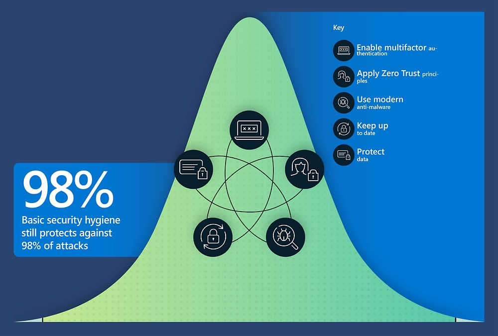

# Hvorfor tilbyr vi Managed Security Posture som en tjeneste?

Nylige rapporter viser at feilkonfigurasjon og mangelfull konfigurasjon er en av de største risikoene ved bruk av offentlige skytjenester. Noen eksempler på dette er Zscaler sin [2022 Cloud Security Report](https://www.zscaler.com/blogs/security-research/2022-cloud-insecurity-report), samt Microsoft sin [Digital Defense Report for 2022](https://www.microsoft.com/en-us/security/business/microsoft-digital-defense-report-2022). 

De ulike skyleverandørene har noe ulik strategi når det gjelder standard innstillinger og sikkerhetsnivå, der man ofte ser at Microsoft har valgt en strategi som forsøker å balansere brukervennlighet og sikkerhet. Dette betyr at det i mange tilfeller er behov for ekstra konfigurasjon for å oppnå tilstrekkelig god sikkerhet, enten det gjelder Microsoft 365, Defender produktene, Azure AD eller Azure. Det er flere tiltak som bør implementeres for å redusere risiko knyttet til konfigurasjon av skytjenester. Her er de 3 viktigste slik vi ser det:

1. Ta i bruk verktøy som automatiserer konfigurasjon og fortløpende verifiserer innstillingene. Automatiserte verktøy sørger for oppdatert konfigurasjon og status i form av revisjon, og bidrar i så måte med å avdekke mangelfull konfigurasjon før det er for sent. 
	
2. Sørg for å ha en sikkerhetspolicy, gjerne basert på kjente standarder. Dette vil gjøre det enklere å prioritere tiltak innenfor de ulike kategoriene samt være med å tydeliggjøre risiko. 
	
3. Foreta jevnlig kartlegging og revisjon av sikkerhetsinnstillinger sett opp mot sikkerhetspolicy. Dette for å sørge for at man til enhver tid er "compliant" iht. de gjeldende kravene i rammeverket man forholder seg til. 

## Hvordan er Managed Security Posture noe annet enn Microsoft Secure Score?

I sum handler dette om følgende, sitert fra NSM sin rapport "Risiko 2022": For å oppdage avvikene fra normalen kreves det årvåkenhet og en forståelse av normalbildet. Microsoft gjør mye for å forbedre innsikt i form av løsninger som Secure Score, Azure Advisor og Defender for Cloud for å nevne noe. Dette er gode løsninger som absolutt bør benyttes, men på den annen side kan det være vanskelig å holde oversikt over de ulike dashboardene, samt at de ofte har mangler når det kommer til ulike innstillinger. Ofte er dette snakk om innstillinger som er basert på erfaring i kombinasjon med "threat hunting" og lignende. Andre innstillinger kan være basert på funn som gjøres i "sikkerhets-community" og som publiseres i ulike kanaler. Dette kan være alt fra sosiale medier til Slack og Discord etc. 

Det er naturlig å tenke at standard innstillinger fra store leverandører av programvare er godt nok, men som tidligere nevnt er dette av ulike årsaker ikke alltid tilfelle. Samtidig er dagens programvare og skybaserte løsninger i kontinuerlig utvikling, noe som fordrer kontinuerlig oppfølging av sikkerhetsrelaterte funksjoner og konfigurasjon av disse, også for å dra nytte av investeringer man har gjort i form av lisenser og lignende. 

Med samme bakgrunn har CISA kommet med noe de kaller ScubaGear M365 Secure Configuration Baseline Assessment Tool. Dette er et verktøy for å operasjonalisere deres Secure Cloud Business Applications (SCuBA) prosjekt. SCuBA er et eksempel på en kilde som benyttes aktivt som grunnlag for kontroller (policies) i Amesto Fortytwo sin Managed Security Posture tjeneste. Mer informasjon om dette her: [cisagov-ScubaGear](https://github.com/cisagov/ScubaGear)

I Amesto Fortytwo tror vi på spesialiserte tjenester som dekker konkrete behov. Et godt eksempel på en slik tjeneste er Managed Security Posture, en tjeneste laget nettopp for å løse behovene knyttet til hardening av skybaserte miljøer. Les mer om Managed Security Posture her: [Cybersecurity services from Amesto Fortytwo](https://www.amestofortytwo.com/cyber-defence-offerings)